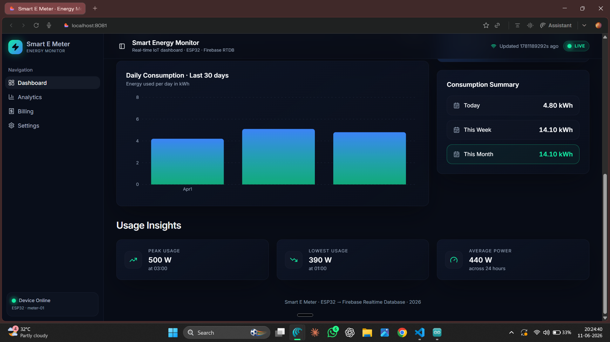
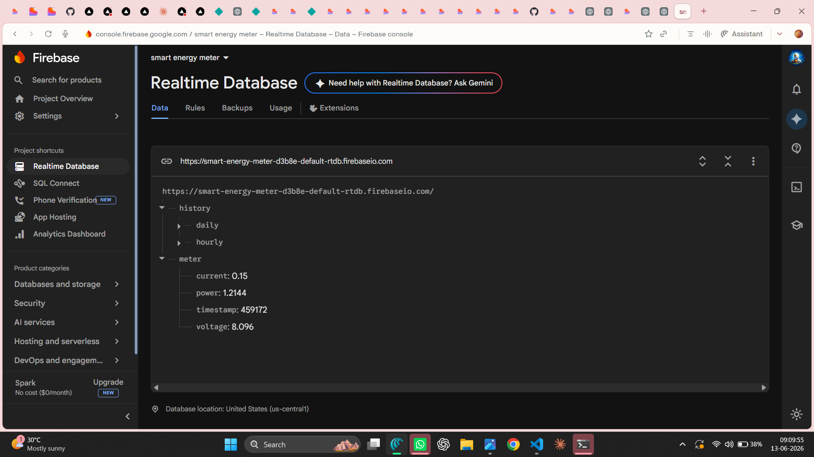
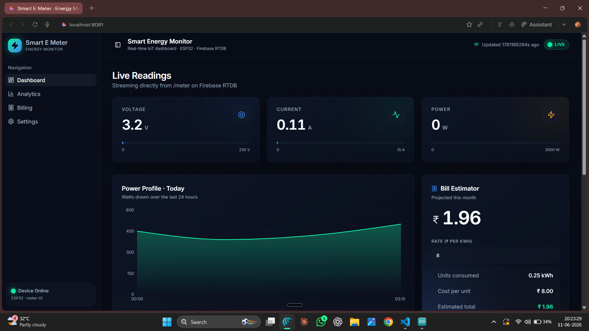

# ⚡ Smart Energy Meter

A real-time IoT energy monitoring system using ESP32, INA219, Firebase RTDB and React.

## Features

- Real-time Voltage Monitoring
- Real-time Current Monitoring
- Power Consumption Tracking
- Firebase Realtime Database
- Interactive Dashboard
- Bill Estimation

## Dashboard

## Firebase Database

## Hardware Setup

## Live Readings

## Tech Stack

- ESP32
- INA219
- Firebase RTDB
- React
- TypeScript
- Vite
- Netlify

## Live Demo

https://smartemeter.netlify.app/

## GitHub Repository

https://github.com/saikiran263/smart-energy-meter